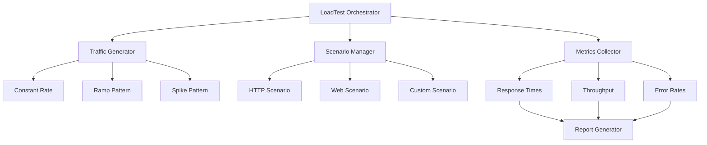

# LoadTest

[](https://github.com/example/loadtest/actions/workflows/ci.yml)
[](https://codecov.io/gh/example/loadtest)
[](https://pypi.org/project/loadtest/)
[](https://www.python.org/)
[](https://opensource.org/licenses/MIT)
[](https://github.com/psf/black)
[](https://loadtest.readthedocs.io)

**A modern, async-first synthetic traffic generator for load testing web applications.**

## Features

- **Async-first architecture** - High concurrency with minimal resource usage
- **Realistic user data** - Integration with Phoney for authentic test data
- **Multiple scenario types** - HTTP API testing and browser automation (Playwright)
- **Traffic patterns** - Constant rate, ramp up/down, and spike testing
- **Rich metrics** - Response times, throughput, error rates, percentiles
- **HTML reports** - Beautiful, interactive test reports
- **Rich CLI output** - Real-time progress and results display
- **Extensible** - Easy to add custom scenarios and generators

## Installation

```bash
pip install loadtest
```

With web automation support:

```bash
pip install "loadtest[web]"  # Includes Playwright
```

## Quick Start

```python
import asyncio
from loadtest import LoadTest
from loadtest.scenarios.http import HTTPScenario
from loadtest.generators.constant import ConstantRateGenerator

async def main():
    # Create a load test
    test = LoadTest(name="API Load Test", duration=60)
    
    # Define an HTTP scenario
    scenario = HTTPScenario(
        name="Get Users",
        method="GET",
        url="https://api.example.com/users",
    )
    
    # Add scenario to test
    test.add_scenario(scenario, weight=1)
    
    # Set traffic pattern: 10 requests per second
    test.set_pattern(ConstantRateGenerator(rate=10))
    
    # Run the test
    results = await test.run()
    
    # Generate report
    test.report(format="html", output="report.html")

asyncio.run(main())
```

## Documentation

- [Getting Started](getting-started/quickstart.md)
- [User Guide](user-guide/core-concepts.md)
- [API Reference](api/core.md)
- [Examples](examples/basic.md)

## Traffic Patterns

| Pattern | Description | Use Case |
|---------|-------------|----------|
| **Constant** | Steady rate of requests | Baseline performance testing |
| **Ramp** | Gradually increase/decrease | Finding breaking points |
| **Spike** | Sudden traffic bursts | Testing auto-scaling |

## Architecture



## Contributing

We welcome contributions! See [CONTRIBUTING.md](https://github.com/example/loadtest/blob/main/CONTRIBUTING.md) for guidelines.

## License

This project is licensed under the MIT License - see the [LICENSE](https://github.com/example/loadtest/blob/main/LICENSE) file for details.
